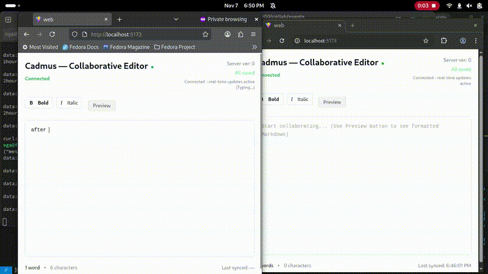

# Cadmus Collaborative Editor

This project is a **full-stack TypeScript solution** for the **Cadmus Software Engineer Homework Task**.  
It implements a **collaborative rich-text editor** built with React (TipTap + ProseMirror) and a Node.js + Express backend.

---

## 🎥 Demo Video



*Real-time collaborative editing in action - the video shows two browsers syncing in real-time*

---

## 🧩 Features

### ✅ Feature 1 — Online Editing Environment
- Built using **TipTap** (React wrapper for ProseMirror)
- Basic text formatting: bold, italic, paragraphs
- Live **word counter**

### ✅ Feature 2 — Collaboration
- Implements **ProseMirror collaboration algorithm**
- Backend HTTP APIs handle steps with ordered versions
- Handles version conflicts (`409 Conflict`) gracefully
- Clients debounce and retry unconfirmed steps
- On reload, the editor fetches the latest server state

### ✅ Feature 3 — Persistence
- Steps are **persisted to disk** (`server/data/steps.json`)
- Steps survive restarts
- File-based storage for simplicity (can be replaced with DB)

---


## ⚙️ Setup Instructions

### 1️⃣ Install and Run Backend
```bash
cd server
npm install
npm run dev
```
Runs at: **http://localhost:4000**

### 2️⃣ Install and Run Frontend
```bash
cd ../web
npm install
npm run dev
```
Runs at: **http://localhost:5173** (or port shown in console)

---

## 🔌 API Endpoints

| Endpoint | Method | Description |
|-----------|--------|-------------|
| `/collab` | `GET`  | Fetch all steps and version |
| `/collab` | `POST` | Submit new steps with version |

---

## 🧠 Example: Using `curl` to Test Collaboration API

### ▶️ 1. Create or append new steps

```bash
curl -X POST http://localhost:4000/collab   -H "Content-Type: application/json"   -d '{
    "version": 1,
    "steps": [
      {
        "clientId": "client-A",
        "step": {
          "stepType": "insert",
          "pos": 1,
          "text": "Hello Cadmus!"
        }
      }
    ]
  }'
```

### ▶️ 2. Fetch all persisted steps

```bash
curl http://localhost:4000/collab
```

### ▶️ 3. Inspect persisted data manually

The server writes to:
```
server/data/steps.json
```


